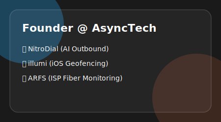

<strong>Founder & Lead Developer at <a href="https://www.async.tech">AsyncTech</a></strong> 
Building high-end digital products, AI automation workflows, and cross-platform mobile experiences.

 

<table width="100%" border="0" cellpadding="0" cellspacing="10" align="center">

<tr>
<td width="55%" valign="top">

</td>
<td width="45%" valign="top" align="center">

</td>
</tr>

<tr>
<td width="50%" valign="top">
<h3 align="left">🛠️ Tech Stack</h3>

 

 

</td>
<td width="50%" valign="top" align="center">

</td>
</tr>

</table>

 

